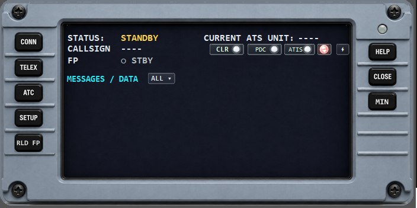
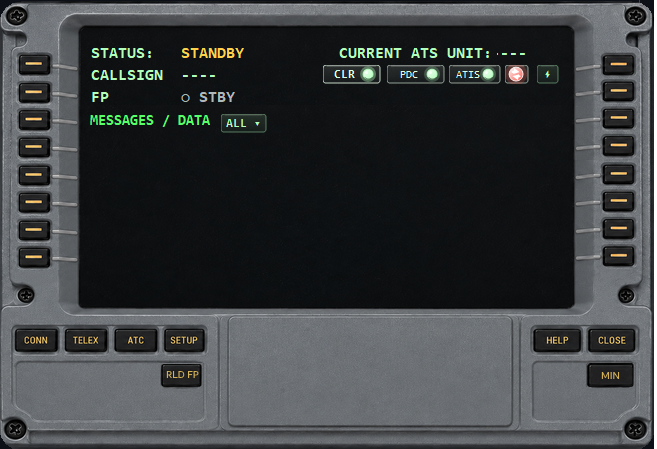

# EasyCPDLC – Modernized


A modernized and visually refreshed fork of **EasyCPDLC**, the lightweight CPDLC client for pilots flying on **VATSIM** via the **Hoppie ACARS** network.

This fork updates EasyCPDLC for **.NET 10** and adds a cockpit-style DCDU interface, Airbus/Boeing visual styles, smarter flight-plan handling, ATIS/METAR quick actions, callsign-change protection, MSFS/Flow Pro support, and many day-to-day workflow improvements for online flying.

---

## Index

- [Screenshots](#screenshots)
- [What is EasyCPDLC?](#what-is-easycpdlc)
- [What changed in this fork?](#what-changed-in-this-fork)
- [Features](#features)
- [Main DCDU overview](#main-dcdu-overview)
- [Flight plan reload workflow](#flight-plan-reload-workflow)
- [Callsign mismatch handling](#callsign-mismatch-handling)
- [Flight phase and next-flight detection](#flight-phase-and-next-flight-detection)
- [Quick Actions, ATIS and METAR](#quick-actions-atis-and-metar)
- [PDC / DCL and REQ CLR](#pdc--dcl-and-req-clr)
- [CPDLC LOGON discovery](#cpdlc-logon-discovery)
- [Clearance workflow and auto-confirm](#clearance-workflow-and-auto-confirm)
- [Status indicators](#status-indicators)
- [Smart message handling](#smart-message-handling)
- [MSFS / Flow Pro integration](#msfs--flow-pro-integration)
- [Flow Pro setup](#flow-pro-setup)
- [Free text cooldown](#free-text-cooldown)
- [Message filtering](#message-filtering)
- [System tray and window behavior](#system-tray-and-window-behavior)
- [Requirements](#requirements)
- [Installation](#installation)
- [First start](#first-start)
- [Short release changelog](#short-release-changelog)
- [Project status](#project-status)
- [Credits](#credits)
- [Disclaimer](#disclaimer)
- [License](#license)

---

## Screenshots

| Login | Airbus-style | Boeing-style |
|---|---|---|
|  |  |  |

---

## What is EasyCPDLC?

**EasyCPDLC** is a standalone CPDLC client for flight simulation. It allows pilots to use CPDLC-style communication with compatible ATC stations on VATSIM without needing an aircraft that has native CPDLC support.

The client connects using your:

- **Hoppie logon code**
- **VATSIM CID**

After connecting, EasyCPDLC can be used for common datalink workflows such as ATC logon, clearance requests, TELEX-style messages, METAR/ATIS requests, and CPDLC communication during online flights.

---

## What changed in this fork?

This fork focuses on modernization, compatibility, cockpit-style visuals, and smoother simulator workflow.

### Highlights

- Updated for **.NET 10**
- Refreshed login screen and connection flow
- Redesigned DCDU-style main interface
- Airbus-inspired and Boeing-inspired display styles
- Main page with aligned `STATUS`, `CALLSIGN`, `ROUTE`, and `FP PHASE`
- Route display below the callsign, including `ROUTE: ----` when no route is loaded
- Smart status badges for CLR, PDC, ATIS, ATIS auto refresh, and Quick Actions
- Click-only PDC / REQ CLR action to avoid accidental hover popups
- PDC/DCL controller-info parsing for formats such as `DCL: XXXX` and `PDC/DCL: XXXX`
- Click-only CPDLC LOGON candidate popup using Hoppie online status, FIR geolocation, nearby FIR buffering, and DEP/ARR APP station matching
- Flight-plan reload workflow for multi-leg flying and callsign changes
- VATSIM prefile support for loading the next route before the new callsign is live
- Callsign mismatch protection so Hoppie keeps the old callsign until VATSIM confirms the new one
- Manual callsign refresh icon next to the callsign during mismatch
- Automatic VATSIM pilot refresh while connected
- Route flash indication when RLD FP loads a different route
- Quick Actions popup for METAR/ATIS departure/arrival requests
- Smarter ATIS/METAR station targeting after departure and after landing
- Flow Pro integration for opening EasyCPDLC from inside MSFS
- Tray integration, hide/show support, and no-activate main window behavior
- Less noisy system messages during normal operation

---

## Features

- Connect to the Hoppie ACARS network
- Use your VATSIM CID for flight/session lookup
- Log on to CPDLC-equipped ATC stations
- Send and receive CPDLC messages
- TELEX-style messaging support
- Datalink clearance workflow support
- PDC/DCL availability detection from controller information
- Click-only REQ CLR quick action when PDC/DCL is confirmed available
- Click-only CPDLC LOGON candidate popup with FIR/APP-based discovery
- Clearance auto-confirm fallback when no final CLRC confirmation is sent
- METAR and ATIS request support
- Quick Actions for departure/arrival METAR and ATIS requests
- Smart ATIS/METAR message summaries
- Lightweight standalone desktop client
- Cockpit-style DCDU interface skins
- Airbus-style and Boeing-style display options
- Message filtering by type
- Unread message highlighting and reminder sound
- Weather message cache
- Exportable message log
- Optional MSFS Flow Pro shortcut support
- System tray support with Show / Hide / Exit
- Main close confirmation
- Flight plan reload button for new VATSIM flight plans or callsign changes
- Automatic callsign mismatch warning and dedicated warning sound
- Manual callsign mismatch re-check button
- Automatic route display and route-change blink
- Automatic flight phase detection using live VATSIM data

---

## Main DCDU overview

The main DCDU page now shows the most important flight/session information directly in the top area:

```text
STATUS:   CONNECTED
CALLSIGN: RYR1234
ROUTE:    EICK-EGPH
FP PHASE: 🛫 DEP
```

If no route is available, the route line remains visible and shows:

```text
ROUTE:    ----
```

The main page also contains compact badges for:

- `CLR`
- `PDC`
- `ATIS`
- ATIS auto refresh
- Quick Actions

The Airbus and Boeing layouts are individually tuned so the top rows, message header, and buttons align with the selected panel style.

---

## Flight plan reload workflow

EasyCPDLC includes a **RLD FP** button for reloading current VATSIM flight data.

Use **RLD FP** when:

- you have landed and continue with another leg
- you filed a new VATSIM flight plan
- your callsign changed
- your departure/arrival airport changed
- EasyCPDLC still shows data from the previous flight

The reload workflow fetches data from:

```text
https://data.vatsim.net/v3/vatsim-data.json
```

It checks both:

- your active VATSIM pilot entry
- your latest VATSIM prefile for the same CID

If a different route is loaded, the `ROUTE` line blinks orange five times.

The **RLD FP** action reloads:

- VATSIM pilot data
- current active callsign
- latest VATSIM prefile if applicable
- filed VATSIM flight plan
- departure and arrival airport
- SimBrief navlog data, if configured
- report fixes
- ATIS/PDC target logic

It also resets:

- current ATS unit
- clearance state
- PDC state
- ATIS state
- cached ATIS/PDC data
- arrival reminder state
- next-flight detection state

Successful reloads are intentionally silent to avoid cluttering the message list. Errors and callsign mismatch warnings are still shown.

---

## Callsign mismatch handling

EasyCPDLC is designed to handle the common VATSIM multi-leg situation where a new flight plan is already prefiled, but the pilot is still online with the previous callsign.

Example:

```text
Online on VATSIM: RYR41WM
New prefile:      RYR156P
```

In this case EasyCPDLC does **not** immediately change the active Hoppie callsign.

Instead:

- Hoppie remains on the old active callsign
- the new route can already be loaded from the prefile
- the callsign on the main page turns red
- a callsign mismatch system message is shown
- a dedicated mismatch warning sound can play
- a small refresh icon appears next to the callsign

The refresh icon:

```text
↻
```

forces an immediate VATSIM callsign check.

If VATSIM still reports the old callsign, nothing changes.  
If VATSIM now reports the new callsign, EasyCPDLC automatically switches Hoppie to the new callsign, resets the current ATS unit, and requires a new CPDLC logon.

EasyCPDLC also checks VATSIM automatically while connected, so the manual icon is optional.

> Note: the manual icon forces EasyCPDLC to check the current VATSIM JSON immediately. It cannot force VATSIM itself to publish the new callsign sooner.

---

## Flight phase and next-flight detection

EasyCPDLC tracks a simple flight phase on the main page.

Possible states include:

- `○ STBY`
- `🛫 DEP`
- `✈ AIRBORN`
- `🛬 ARR`
- `🧳 LND`
- `🆕 NEXT FP`

While connected, EasyCPDLC refreshes the pilot data from VATSIM automatically and updates the phase without requiring user interaction.

Current flight-phase logic:

```text
<= 3000 ft       DEP / LND
> 3000 ft        AIRBORN
>= 20000 ft      enroute marker set
< 20000 ft after enroute  ARR
<= 3000 ft after ARR      LND
```

The phase logic is used for:

- departure/arrival weather targeting
- PDC/ATIS station targeting
- arrival reminder behavior
- next flight plan detection

After landing, EasyCPDLC can detect that a new flight plan has been filed and offer a reload prompt. Detection begins shortly after landing and continues periodically while relevant.

---

## Quick Actions, ATIS and METAR

The lightning badge opens **Quick Actions**.

Quick Actions can request:

- departure METAR
- arrival METAR
- departure ATIS
- arrival ATIS

Quick Actions are only clickable when EasyCPDLC is **CONNECTED**. In standby or disconnected state, the popup does not open.

The weather target logic is aware of the loaded flight plan:

- before departure, departure airport is preferred
- after becoming airborne, arrival airport is preferred
- after landing, arrival airport remains preferred until RLD FP loads the next flight

If a new route is loaded with RLD FP, the TELEX and Quick Actions weather targets update to the new route.

ATIS station selection can prefer:

- departure ATIS variants for departure requests
- arrival ATIS variants for arrival requests
- generic station names when needed

---


## PDC / DCL and REQ CLR

The PDC badge indicates whether a departure clearance service appears to be available for the relevant airport.

EasyCPDLC checks:

- direct Hoppie station availability for the airport code
- local VATSIM controllers such as `XXXX_DEL`, `XXXX_GND`, `XXXX_TWR`, and `XXXX_APP`
- controller ATIS/info lines for PDC or DCL logon information
- Hoppie online status for the detected logon code

Supported controller-info formats include:

```text
DCL: XXXX
DCL LOGON XXXX
DCL LOGON CODE XXXX
PDC/DCL: XXXX
XXXX DCL
PREDEP CLEARANCE ... XXXX
DEPARTURE CLEARANCE ... XXXX
DATALINK CLEARANCE ... XXXX
```

When PDC/DCL is confirmed available, the PDC badge turns green.

The **REQ CLR** action is click-only:

1. Click the `PDC` badge.
2. If PDC/DCL is confirmed available, `REQ CLR` appears.
3. Click `REQ CLR` to send a pre-departure clearance request using the detected logon code.

Mouseover does not open REQ CLR anymore. This prevents the action from disappearing while the user is trying to select it.

REQ CLR is only offered when PDC/DCL is confirmed available. If the PDC badge is not green, clicking it does not send anything.

---

## CPDLC LOGON discovery

The CPDLC LOGON helper is shown via the `📡` icon next to the current ATS unit.

The LOGON menu is click-only:

1. Click the `📡` icon.
2. EasyCPDLC shows available `LOGON TO XXXX` candidates.
3. Click a candidate to send the CPDLC logon request.

Mouseover does not open the menu anymore.

EasyCPDLC only shows LOGON candidates when the detected station is online on Hoppie. Candidate discovery can use:

- current FIR geolocation from VATSIM FIR boundary data
- a nearby FIR buffer near FIR boundaries
- DEP/ARR-related APP stations
- controller ATIS/info lines that mention CPDLC, Hoppie, logon, PDC, or DCL information

The FIR/nearby logic is intended as a helper. If a candidate is marked as possible or nearby, pilots should still verify the correct logon with ATC.

---

## Clearance workflow and auto-confirm

The CLR badge tracks the clearance workflow.

Typical states:

- neutral / standby
- request sent
- clearance received
- pilot acknowledged
- clearance accepted / confirmed
- rejected / unable

Some PDC/DCL stations do not send a final `CLRC CONFIRMED` message after the pilot sends WILCO or an equivalent acknowledgement.

To avoid leaving the clearance state stuck without a green confirmation, EasyCPDLC starts a 3-minute auto-confirm timer after:

- `WILCO`
- `AFFIRMATIVE`
- `ROGER`
- `ACCEPT`

If no final clearance confirmation and no rejection arrives within 3 minutes, EasyCPDLC sets:

```text
CLR ACC AUTO
```

This turns the CLR state green. The original clearance text remains visible, and the CLR popup adds:

```text
AUTO CONFIRMED AFTER 3 MIN WITHOUT CLRC CONFIRMED
```

If a real confirmation, rejection, unable, or denied message arrives before the timer expires, the timer is cancelled and the real network/controller result is used.

---

## Status indicators

The main DCDU page includes compact status indicators below the current ATC unit area.

### CLR

The CLR indicator shows the current clearance state:

- white = neutral / no active clearance state
- orange = requested / standby / waiting
- green = received, accepted, or auto-confirmed
- red = rejected / unable / denied

The CLR popup now uses the same footprint as the ATIS popup for a consistent layout.

### PDC

The PDC indicator shows whether a matching Hoppie PDC/DCL station appears to be available:

- white = unknown / not checked yet
- green = confirmed available and Hoppie-online
- orange = possible fallback candidate
- red = offline / unavailable

PDC/DCL detection can parse controller information lines such as `DCL: XXXX`, `DCL LOGON XXXX`, or `PDC/DCL: XXXX`.

REQ CLR is opened only by clicking the PDC badge and is only offered when the PDC state is confirmed green.

### ATIS

The ATIS indicator shows whether ATIS data is available for the currently relevant airport.

- before departure: departure airport
- airborne / after departure: arrival airport
- after landing: arrival airport until **RLD FP** is used

### ATIS auto refresh

ATIS auto refresh can monitor the active ATIS target and update the state without repeatedly adding unnecessary system messages.

---

## Smart message handling

The modernized message overview improves readability by converting common datalink responses into shorter cockpit-style summaries.

Examples:

- `REQUESTING ATIS FOR LOWW`
- `LOWW ATIS E RECEIVED QNH 1012 RWY 29`
- `REQUESTING METAR FOR LOWW`
- `LOWW METAR RECEIVED QNH 1012 WIND 290/08 RWY 29`
- `ATIS NOT AVAILABLE`
- `VATSIM CALLSIGN MISMATCH`
- `NEW FP DETECTED`
- `AUTO CONFIRMED AFTER 3 MIN WITHOUT CLRC CONFIRMED`

ATIS responses try to detect the current ATIS information letter and display it directly in the message list.

Unread messages are highlighted and can trigger a reminder sound.

---

## MSFS / Flow Pro integration

EasyCPDLC can be opened from inside Microsoft Flight Simulator using **Parallel 42 Flow Pro**.

The application registers a Windows URI protocol:

```text
easycpdlc://show
```

When this URI is called, EasyCPDLC brings its already running window back to the front. This allows you to open the CPDLC client from inside MSFS without going back to the desktop.

There is also an optional toggle URI:

```text
easycpdlc://toggle
```

For normal use, `easycpdlc://show` is recommended.

### Notes

- This works best with MSFS in borderless/windowed fullscreen.
- In exclusive fullscreen, Windows may still show the taskbar or change focus behavior.
- EasyCPDLC uses a tray icon so it can run in the background without a normal taskbar button.
- If the URI does not work, start EasyCPDLC once normally first. The URI protocol is registered on application start.

---

## Flow Pro setup

To create a Flow Pro button that opens EasyCPDLC:

1. Start EasyCPDLC once normally.
2. Confirm that this works in Windows:
   - Press `Win + R`
   - Enter:

     ```text
     easycpdlc://show
     ```

   - EasyCPDLC should appear.
3. Open MSFS.
4. Open the Flow Pro wheel editor.
5. Add a **Custom Script Widget**.
6. Open the widget editor.
7. Paste this JavaScript code:

```js
run(() => {
    this.$api.command.open_browser("easycpdlc://toggle");
    return 250;
});

info(() => {
    return "Toggle EasyCPDLC";
});
```

---

## Free text cooldown

To reduce accidental or excessive free-text usage, free-text messages use a cooldown system.

By default, free text can only be sent once every 5 minutes.

If free text is attempted too early, EasyCPDLC shows a system message such as:

```text
FREE TEXT AVAILABLE IN 04:32
```

METAR and ATIS requests are not affected by this cooldown.

---

## Message filtering

The message overview can be filtered by message type.

Available filters include:

- ALL
- NEW
- ATIS
- METAR
- CPDLC
- TELEX
- SYSTEM

This makes it easier to keep the DCDU overview readable during busy flights.

---

## System tray and window behavior

EasyCPDLC supports a system tray icon with:

- Show
- Hide
- Exit

The main window can be brought back from the tray or via the Flow Pro URI.

The main DCDU window is designed to appear without stealing focus from MSFS where possible. Child windows such as ATC, TELEX, settings, and request windows remain focusable.

Closing the main window asks for confirmation to avoid accidental shutdown.

---

## Requirements

- Windows
- .NET 10 Desktop Runtime
- VATSIM account and CID
- Hoppie ACARS logon code
- Active internet connection
- Optional: SimBrief Pilot ID for navlog/report-fix integration
- Optional: Parallel 42 Flow Pro for MSFS cockpit shortcut integration

> Note: the .NET Desktop Runtime may already be included in packaged builds, depending on the release.

---

## Installation

### Download a release

1. Download the latest release from the repository's **Releases** page.
2. Extract the ZIP file to a folder of your choice.
3. Start `EasyCPDLC.exe`.
4. Enter your Hoppie logon code and VATSIM CID.
5. Click **Connect**.

---

## First start

1. Open EasyCPDLC.
2. Enter your **Hoppie logon code**.
3. Enter your **VATSIM CID**.
4. Enable **Remember Me** if you want the client to save your login details locally.
5. Press **Connect**.
6. Use the DCDU panel to access CPDLC, TELEX, ATC, and setup functions.
7. On the setup page, choose between Boeing and Airbus style.
8. Add your SimBrief Pilot ID if you want SimBrief navlog integration.
9. Optional: create a Flow Pro widget using the [Flow Pro setup](#flow-pro-setup) section.

---

## Short release changelog

- Added modern Airbus/Boeing DCDU main layout with aligned status, callsign, route, and flight phase.
- Flight phase now switches to ARR below FL200 after enroute detection.
- Added RLD FP workflow for VATSIM active flight plans, prefiles, new routes, and callsign changes.
- Added callsign mismatch protection with red callsign, warning sound, automatic refresh, and manual refresh icon.
- Added route display and orange route blink when a different route is loaded.
- Added Quick Actions for departure/arrival METAR and ATIS requests.
- Added click-only PDC / REQ CLR action with PDC/DCL logon parsing from controller info.
- Added click-only CPDLC LOGON popup with Hoppie-online validation, FIR geolocation, nearby FIR buffer, and DEP/ARR APP matching.
- Added CLR auto-confirm after 3 minutes when no final CLRC confirmation is sent.
- Made CLR popup match ATIS popup size.
- Improved ATIS status priority so VATSIM ATIS can override stale negative Hoppie/VATATIS responses.
- Improved ATIS/METAR message filtering and aligned the message filter dropdown with `MESSAGES / DATA`.
- Added NEW FP prompt cleanup after RLD FP / IGNORE and alert sound for new flight-plan detection.
- Improved inbound flat TELEX parsing.
- Added Flow Pro URI support, tray show/hide behavior, and safer close confirmation.
- Reduced noisy system messages during successful reload and auto-refresh operations.

---

## Project status

This is a community-maintained modernization fork. The main goals are:

- keeping EasyCPDLC compatible with modern .NET versions
- improving the user interface
- making CPDLC more comfortable for day-to-day VATSIM flying
- improving MSFS cockpit workflow with Flow Pro and tray integration
- improving multi-leg and callsign-change workflows

---

## Credits

Original project:

**EasyCPDLC**  
Copyright (C) 2022 Joshua Seagrave

This project is based on the original **EasyCPDLC** project by **quassbutreally**:  
https://github.com/quassbutreally/EasyCPDLC

Thanks to the VATSIM and Hoppie communities for making realistic datalink simulation possible for online pilots.

---

## Disclaimer

EasyCPDLC is a third-party community tool for flight simulation. It is not affiliated with, endorsed by, or officially connected to VATSIM, Hoppie, aircraft manufacturers, or real-world aviation authorities.

This software is provided as is, without warranty of any kind, express or implied.

The authors and contributors are not responsible or liable for any damages, data loss, connection issues, network disruptions, incorrect messages, missed ATC instructions, software crashes, simulator issues, or any other problems resulting from the use or inability to use this software.

This project is intended for flight simulation use only.

It must not be used for real-world aviation, real-world communication, real-world navigation, operational flight planning, or any safety-critical purpose.

Use this software at your own risk.

This project is an unofficial community modification/fork and is not affiliated with, endorsed by, or officially supported by VATSIM, the Hoppie ACARS network, or the original EasyCPDLC author.

---

## License

This project is licensed under the GNU General Public License v3.0 or later.
